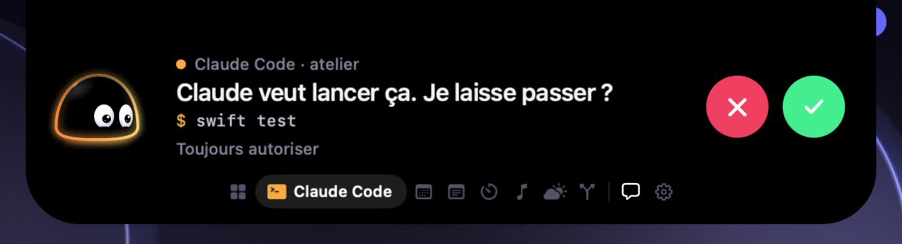

<p align="center">
  
</p>

<h1 align="center">Yumi</h1>

<p align="center">
  A small companion that lives in the notch of your Mac.<br>
  He watches your agents, listens to your music with you, and tells you when to take a break.
</p>

<p align="center">
  <a href="https://github.com/estebanbaigts/Yumi/actions/workflows/build.yml"></a>
  
  
  
</p>

<p align="center">
  
</p>

Yumi is a native macOS app: Swift 6, SwiftUI and AppKit, no third-party dependency. The character is drawn in code, frame by frame.

> **Status: work in progress.** The app builds and runs every day on its author's Mac. There is no packaged release yet: build it from source. The interface speaks French for now.

## What he does

**He follows Claude Code.** Every session, in every terminal and editor, shows up in the notch: thinking, running a tool, finished, failed. When Claude Code asks for a permission, the island opens and you answer from there, without switching windows. If you do not answer, the question goes back to Claude Code as usual.

**He shows one thing at a time.** Folded, the island shows what matters now: the track playing, the session at work, the next meeting. Open, a rail of icons lets you move between the modules.

<p align="center">
  
</p>

**You talk, he acts.** The chat runs through the Claude Code already installed on your Mac, so it needs no API key and adds no bill. Yumi can create files, which land in Downloads, and asks before each action.

<p align="center">
  
</p>

**He remembers, and speaks first.** Yumi keeps what you tell him in a plain text file on your Mac, that you can read, edit and erase from the settings. He leaves secrets out of it. He also speaks up on his own on a few occasions (two hours without a break, a meeting coming, an agent waiting), and a setting makes him more or less discreet.

**He is alive.** A soft body, eyes that follow, a rim of light that carries his state, habits when he is bored, and a small scene for each GitHub event: a star, a fork, a merged pull request.

## Modules

| Module | What it shows | What it needs |
| --- | --- | --- |
| Claude Code | Sessions, activity, permission requests | Yumi's hooks, installed from the settings |
| Agenda | The next event of the day | Calendar access |
| Notes | Today's reminders, ticked from the notch | Reminders access |
| Focus | A work timer and its breaks | Nothing |
| Music | The track playing, pause, next, previous | Automation, for Music or Spotify |
| Weather | The sky where you are | Location, or a city typed by hand |
| GitHub | Stars, forks, pull requests, pushes on your repositories | A personal access token |

You choose which modules appear and in which order.

## Build

You need macOS 15 or later, Xcode 16 or later, [XcodeGen](https://github.com/yonaskolb/XcodeGen), and `python3` on your `PATH` for the hook script. The chat also needs [Claude Code](https://claude.com/claude-code) installed.

```bash
brew install xcodegen
```

```bash
git clone https://github.com/estebanbaigts/Yumi.git
```

```bash
cd Yumi/Yumi && xcodegen && open Yumi.xcodeproj
```

Then press ⌘R in Xcode. From the command line:

```bash
cd Yumi && xcodegen && xcodebuild -scheme Yumi -configuration Debug build
```

The Xcode project and the `Info.plist` files are generated from [Yumi/project.yml](Yumi/project.yml) and are not in git: change `project.yml` and run `xcodegen` again.

The Debug build is not signed, so macOS asks again for the permissions after each rebuild.

### Tests

```bash
cd Yumi && xcodegen && xcodebuild -scheme Yumi -configuration Debug test CODE_SIGNING_ALLOWED=NO
```

The tests run without launching the app. Continuous integration runs the build and the tests on every push.

## Set up Claude Code

Open Yumi's settings and choose to install the hooks. Yumi shows the exact change before writing anything, saves a dated backup of `~/.claude/settings.json`, and merges its entries with yours. The same screen removes them.

The hook is a small script that forwards each event to the app over a local Unix socket. If Yumi is not running, the script exits at once and Claude Code carries on. Installing Yumi's hooks removes those of Coucou or NotchBuddy if they are present: Yumi replaces them.

## Permissions

Yumi works without any of these. Each one unlocks a feature, and is asked for when you first use it.

| Permission | What it is for |
| --- | --- |
| Calendar | Announcing your next event |
| Reminders | Showing today's reminders and ticking them |
| Location | The weather where you are, to the nearest kilometre |
| Automation | Pause and next track, the address of the page you show him |
| Accessibility | The title of the window you show him, the Escape key, the global shortcut |
| Downloads | Dropping the files you ask him to create |
| Login item | Launching Yumi at startup, if you turn it on |

## Privacy

- No telemetry, no account, no server of ours.
- The calendar, the reminders and the memory never leave your Mac.
- Network calls go only to the services behind the modules you turned on: Open-Meteo for the weather, GitHub with your own token.
- The chat goes through your own Claude Code, under your own account.
- Tokens are stored in the macOS Keychain, never on disk and never in git.
- Yumi never approves a Claude Code permission without an explicit click.

## Repository

```
Yumi/                    the app
├── project.yml          XcodeGen project, source of truth for the build
├── Sources/App/         all Swift code
├── Tests/               unit tests (Swift Testing)
└── Resources/           entitlements, sounds
design/yumi/             character sheet, voice, mockups, video plan
motion/                  the presentation film, made with Remotion
scripts/release.sh       signed and notarized build
```

- [YUMI.md](YUMI.md): decisions, character design brief, work plan (in French).
- [design/yumi/voix.md](design/yumi/voix.md): how Yumi speaks, what he remembers, when he speaks first (in French).
- [ARCHITECTURE.md](ARCHITECTURE.md): analysis of the original code base, system by system.
- [CONTRIBUTING.md](CONTRIBUTING.md): how to build, test and propose a change.
- [motion/README.md](motion/README.md): the film, the stories and how to render them.

## Roadmap

- A signed and notarized release. [scripts/release.sh](scripts/release.sh) is ready, it needs an Apple Developer team.
- Connected modules: Notion, n8n, Make.
- English interface.
- Macs without a notch.
- App Store, then Windows and Linux.

## Credits and license

Yumi is built on the source code of [Coucou](https://github.com/Louis-CFM/coucou) by Louis Raillé, used under the MIT License. Yumi is an independent project, not affiliated with or endorsed by the author of Coucou. [ATTRIBUTION.md](ATTRIBUTION.md) lists what comes from Coucou and what does not.

The code is under the [MIT License](LICENSE). The Yumi name, the character, the icons, the sounds and the film in `motion/` are not: see [LICENSE-ASSETS.md](LICENSE-ASSETS.md) and [motion/LICENSE.md](motion/LICENSE.md).
