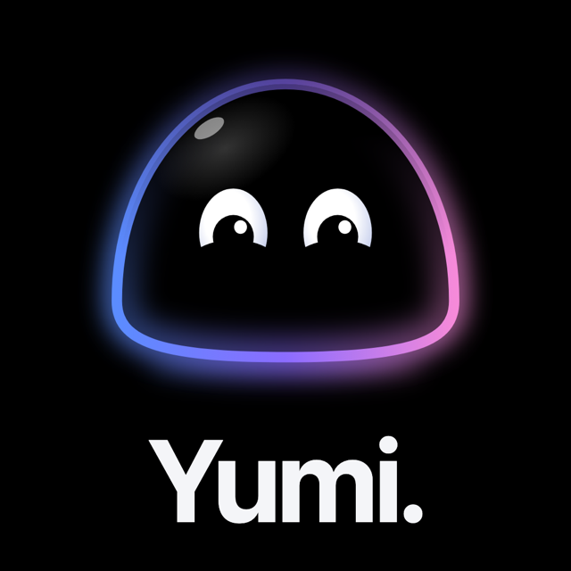
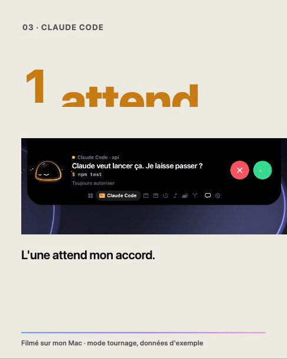
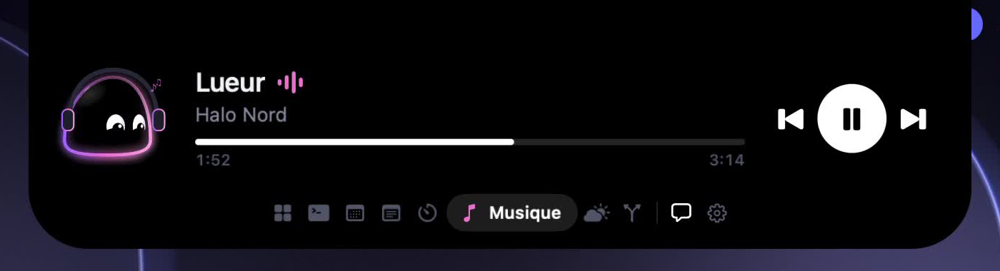
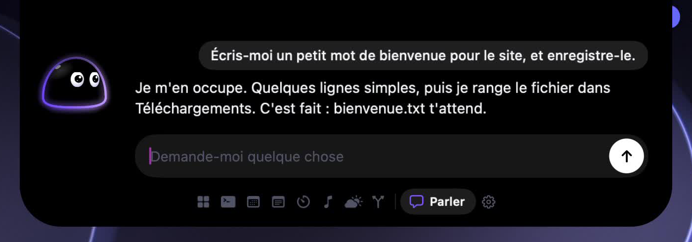

<p align="center">
  
</p>

<h1 align="center">Yumi</h1>

<p align="center">
  A small companion that lives in the notch of your Mac.<br>
  He watches your agents, listens to your music with you, and tells you when to take a break.
</p>

<p align="center">
  <a href="https://github.com/estebanbaigts/Yumi/actions/workflows/build.yml"></a>
  
  
  
</p>

<p align="center">
  <a href="https://github.com/estebanbaigts/Yumi/releases"><b>⬇ Download the free alpha</b></a>
  ·
  <a href="https://estebanbaigts.github.io/Yumi/">Website</a>
  ·
  <a href="https://github.com/estebanbaigts/Yumi/issues/new/choose">Give feedback</a>
</p>

<p align="center">
  
</p>

Yumi is a native macOS app: Swift 6, SwiftUI and AppKit, no third-party dependency. The character is drawn in code, frame by frame.

> **Status: public alpha.** [Download the latest alpha](https://github.com/estebanbaigts/Yumi/releases) (macOS 15+). It is not notarized by Apple yet: the first time, open System Settings › Privacy & Security and click « Open Anyway ». The interface speaks French for now. Feedback is very welcome: it decides what comes next.

## What he does

**He follows Claude Code.** Every session, in every terminal and editor, shows up in the notch with what it is working on: your request, the task of Claude's todo list and its progress (3/7), the action in progress ("Edits IslandModel.swift", "Runs swift test"), the last files and commands, and when a turn ends a short summary of what was done. Click a session to unfold it. All of this is read from the hooks and, for Claude's last message, from the session's transcript on your Mac; none of it is sent to Yumi's engine or anywhere else, and keys or tokens in commands are masked. When Claude Code asks for a permission, the island opens and you answer from there, without switching windows. If you do not answer, the question goes back to Claude Code as usual.

**He shows one thing at a time.** Folded, the island shows what matters now: the track playing, the session at work, the next meeting. Open, a rail of icons lets you move between the modules.

<p align="center">
  
</p>

**You talk, he acts.** The chat runs through the Claude Code already installed on your Mac: in the chat it talks, reads and searches, and changes nothing. When you ask for an action, Yumi's own agent plans it, asks you before anything changes (showing the exact file and what it will hold, the reminder or the event, with a minute to answer once the question is on screen), does it and checks that it is really there. Today he can:

- create a new text file, in Downloads unless you name the Desktop or Documents (never replacing a file);
- add a line at the end of a file he created himself;
- add a reminder to your default Reminders list;
- add an event to your default calendar, without inviting anyone;
- start a Focus session (no question asked: nothing leaves the Mac);
- sum up your day from what his modules already show (no question asked).

He never deletes, sends, runs a command or edits a file he did not create. A request he cannot do is refused and passed to nobody. If a step that writes takes too long, he does not try it a second time and tells you to check.

### Which model Yumi thinks with

The engine chats with you and proposes the plans. Whichever it is, every plan is checked by Yumi (known tools only, valid arguments, risk set by Yumi's code), every change asks you first, and the result is verified. In the chat, no engine has a tool that changes your Mac. What goes with your messages is said under « Privacy ».

By default (« Automatique ») Yumi takes the first one ready, in this order; the settings, section Moteurs, let you pick one, change the order, enter keys and models, and test each engine.

| Engine | What you need | What leaves your Mac, and who bills it |
|---|---|---|
| **Claude Code** | Installed and logged in (`claude`, then `/login`). Used without any tool, shell, file, web, MCP server, settings or hooks. | Your messages and plan requests go to Anthropic through your Claude Code account (your subscription or that account's billing). Not free. |
| **Anthropic API** | A key in the settings. | Your messages and plan requests go to Anthropic. Billed by Anthropic per use. |
| **OpenAI API** | A key in the settings (default model `gpt-4o-mini`, editable). | Your messages and plan requests go to OpenAI. Billed by OpenAI per use. |
| **Google Gemini API** | A key in the settings (default model `gemini-2.5-flash`, editable). | Your messages and plan requests go to Google. Its free tier is enough to try; beyond it, billed by Google. |
| **Ollama** | [Ollama](https://ollama.com) running on your Mac, with a model installed (chosen in the settings). | Nothing leaves your Mac. Free. |

Keys are stored in the macOS Keychain, never in a log or the permission history. Yumi does not use other command-line agents (Codex, Gemini CLI): it cannot prove they run without tools. With no engine ready, Yumi says so and does nothing. The App Store build cannot use Claude Code.

<p align="center">
  
</p>

**He remembers, and speaks first.** Yumi keeps what you tell him in a plain text file on your Mac, that you can read, edit and erase from the settings. He leaves secrets out of it. He also speaks up on his own on a few occasions (two hours without a break, a meeting coming, an agent waiting), and a setting makes him more or less discreet.

**He is alive.** A soft body, eyes that follow, a rim of light that carries his state, habits when he is bored, and a small scene for each GitHub event: a star, a fork, a merged pull request.

## Modules

| Module | What it shows | What it needs |
| --- | --- | --- |
| Claude Code | Sessions, activity, permission requests | Yumi's hooks, installed from the settings |
| Agenda | The next event of the day | Calendar access |
| Notes | Today's reminders, ticked from the notch | Reminders access |
| Focus | A work timer and its breaks | Nothing |
| Music | The track playing, pause, next, previous | Automation, for Music or Spotify |
| Weather | The sky where you are | Location, or a city typed by hand |
| GitHub | Stars, forks, pull requests, pushes on your repositories | A personal access token |
| Notion | Today's unfinished tasks and the late ones, from the databases you choose; a click opens the page | An internal integration key, and the databases shared with it |

You choose which modules appear and in which order.

## Build

You need macOS 15 or later, Xcode 16 or later, [XcodeGen](https://github.com/yonaskolb/XcodeGen), and, for the hook script that shows Claude Code sessions in the notch, a `python3`: Homebrew's, python.org's, or Apple's once the Command Line Tools are installed (`xcode-select --install`). Without one, Claude Code works as usual and only the sessions are missing; the settings say so. The chat also needs [Claude Code](https://claude.com/claude-code) installed.

```bash
brew install xcodegen
```

```bash
git clone https://github.com/estebanbaigts/Yumi.git
```

```bash
cd Yumi/Yumi && xcodegen && open Yumi.xcodeproj
```

Then press ⌘R in Xcode. From the command line:

```bash
cd Yumi && xcodegen && xcodebuild -scheme Yumi -configuration Debug build
```

The Xcode project and the `Info.plist` files are generated from [Yumi/project.yml](Yumi/project.yml) and are not in git: change `project.yml` and run `xcodegen` again.

The Debug build is not signed, so macOS asks again for the permissions after each rebuild.

### Tests

```bash
cd Yumi && xcodegen && xcodebuild -scheme Yumi -configuration Debug test CODE_SIGNING_ALLOWED=NO
```

The tests run without launching the app. Continuous integration runs the build and the tests on every push.

## Set up Claude Code

Open Yumi's settings and choose to install the hooks. Yumi shows the exact change before writing anything, saves a dated backup of `~/.claude/settings.json`, and merges its entries with yours. The same screen removes them.

The hook is a small script that forwards each event to the app over a local Unix socket. If Yumi is not running, the script exits at once and Claude Code carries on. Installing Yumi's hooks removes those of Coucou or NotchBuddy if they are present: Yumi replaces them.

## Permissions

Yumi works without any of these. Each one unlocks a feature, and is asked for when you first use it.

| Permission | What it is for |
| --- | --- |
| Calendar | Announcing your next event, adding the events you ask for |
| Reminders | Showing today's reminders, ticking them, adding the ones you ask for |
| Location | The weather where you are, to the nearest kilometre |
| Automation | Pause and next track, the address of the page you show him |
| Accessibility | The title of the window you show him, the Escape key, the global shortcut |
| Downloads, Desktop, Documents | Creating the files you ask for, and adding to them |
| Login item | Launching Yumi at startup, if you turn it on |

## Privacy

- No telemetry, no account, no server of ours.
- The memory never leaves your Mac. The calendar, the reminders and your Notion tasks are read on your Mac (Notion from its API, with your key); the engine only gets Yumi's own answer about your day (one or two sentences), which then stays in the conversation like any message.
- Notion: only the databases you tick in the settings are read. Yumi adds a task only through the agent, with your approval each time, and never changes or deletes a page.
- Network calls go only to the services behind the modules you turned on (Open-Meteo for the weather, GitHub and Notion with your own keys) and to the engine you use (see « Which model Yumi thinks with »).
- The chat goes through that engine: your own Claude Code under your account, the API whose key you saved, or Ollama on your Mac.
- When you open the chat, the name of the app in front, its window title and the site's domain are attached to your first message, and shown in the notch (« With … »); one click removes them, another attaches them again. The content of your screen is never sent. Only an explicit gesture (« Summarize », a window dragged onto Yumi, a dropped file) sends the full address of the page, or the file.
- A plan request sends the model your words, the last few messages of the chat, today's date and time, the list of Yumi's tools and the names of the last files he created. The window in front goes to the planner only from the Agent section of the settings, when you tick it for that request.
- « Always » on a Claude Code permission in the notch writes a permanent rule in your Claude Code settings (Claude Code's `updatedPermissions`). You remove it from Claude Code's settings (`/permissions` in Claude Code).
- Tokens are stored in the macOS Keychain, never on disk and never in git.
- Yumi never approves a Claude Code permission without an explicit click.
- Every permission decision, Yumi's own and those of the chat, is kept in one history on your Mac (Settings, Yumi's permissions): which tool, which file or site, what was decided. Never the content, the search or the full address.

## Repository

```
Yumi/                    the app
├── project.yml          XcodeGen project, source of truth for the build
├── Sources/App/         all Swift code
├── Tests/               unit tests (Swift Testing)
└── Resources/           entitlements, sounds
design/yumi/             character sheet, voice, mockups, video plan
motion/                  the presentation film, made with Remotion
scripts/release.sh       signed and notarized build
```

- [YUMI.md](YUMI.md): decisions, character design brief, work plan (in French).
- [design/yumi/voix.md](design/yumi/voix.md): how Yumi speaks, what he remembers, when he speaks first (in French).
- [ARCHITECTURE.md](ARCHITECTURE.md): analysis of the original code base, system by system.
- [CONTRIBUTING.md](CONTRIBUTING.md): how to build, test and propose a change.
- [motion/README.md](motion/README.md): the film, the stories and how to render them.

## Roadmap

- A signed and notarized release. [scripts/release.sh](scripts/release.sh) is ready, it needs an Apple Developer team.
- Connected modules: Notion, n8n, Make.
- English interface.
- Macs without a notch.
- App Store, then Windows and Linux.

## Credits and license

Yumi is built on the source code of [Coucou](https://github.com/Louis-CFM/coucou) by Louis Raillé, used under the MIT License. Yumi is an independent project, not affiliated with or endorsed by the author of Coucou. [ATTRIBUTION.md](ATTRIBUTION.md) lists what comes from Coucou and what does not.

The code is under the [MIT License](LICENSE). The Yumi name, the character, the icons, the sounds and the film in `motion/` are not: see [LICENSE-ASSETS.md](LICENSE-ASSETS.md) and [motion/LICENSE.md](motion/LICENSE.md).
